# User Journey: Enthusiast Builder

**Persona:** Alex, a 28-year-old DIY car enthusiast planning a K-series engine swap and suspension upgrade for their 2018 Honda Civic.

**Goal:** Research parts, understand labor requirements, connect with a knowledgeable mechanic, and track the project to completion.

## Journey Flow

```mermaid
flowchart TD
    A["😎 Alex lands on Wrench<br/>Motivated by Reddit r/Civic post"] --> B["Sees: 'What are you building?'"]
    B --> C["Types in chat:<br/>'Want to put a K20 in my 2018 Civic'"]
    C --> D{"Advisor clarifies<br/>Question 1 of 3"}
    D -->|"Do you want K20Z3 or K24?"| E["Alex: 'Z3, more common'"]
    E --> F{"Advisor clarifies<br/>Question 2 of 3"}
    F -->|"Stock suspension or<br/>upgrade too?"| G["Alex: 'Yeah, coilovers,<br/>sway bars, bracing'"]
    G --> H{"Advisor clarifies<br/>Question 3 of 3"}
    H -->|"Daily driver or<br/>track-only?"| I["Alex: 'Mix of both,<br/>spirited drives'"]
    I --> J["🎯 Build summary appears<br/>K20Z3 + suspension,<br/>daily/track goals"]
    J --> K["Alex: 'Looks good, build it'"]
    K --> L["✅ Build created silently<br/>ID: build_abc123<br/>Workspace opens"]
    
    L --> M["📋 Parts workspace view"]
    M --> N["Parts grouped by goal:<br/>🔵 Daily Driver<br/>🔴 Track Performance<br/>🟡 Both"]
    
    N --> O["Alex sees parts list<br/>with pricing:<br/>• K20Z3 block: $1200<br/>• DC5R head: $800<br/>• RockAuto coilovers: $600<br/>• Etc."]
    
    O --> P["Advisor chip shows:<br/>'~$5k estimated,<br/>here's how to phase it'"]
    
    P --> Q["Alex clicks<br/>'Upload car photo'"]
    Q --> R["📸 Uploads 3 photos<br/>of current Civic"]
    R --> S["Vision analysis<br/>runs in background"]
    S --> T["Advisor updates parts:<br/>'Great K-series bay,<br/>confirmed space for coils,<br/>may need strut brace'"]
    
    T --> U["Alex browses parts,<br/>clicks on header<br/>to see options"]
    U --> V["Shows 4 vendors:<br/>Amazon, RockAuto,<br/>eBay, Local shop<br/>with shipping/ratings"]
    
    V --> W["Alex clicks<br/>'Connect with Mechanic'"]
    W --> X["Mechanic search:<br/>Filter by location,<br/>K-series experience,<br/>shop size"]
    X --> Y["Results: 3 mechanics<br/>in area"]
    
    Y --> Z["Alex clicks on<br/>Mike's Civic Shop<br/>K-series specialist"]
    Z --> AA["Mechanic profile:<br/>Reviews, experience,<br/>Labor rate: $85/hr<br/>Est. 25 hrs K-series work"]
    
    AA --> AB["Alex: 'Request quote'"]
    AB --> AC["Chat opens between<br/>Alex & Mike's shop"]
    AC --> AD["Mike reviews build,<br/>suggests alternatives:<br/>'OEM K20Z3 vs rebuilt vs<br/>new with warranty'"]
    
    AD --> AE["Alex and Mike<br/>finalize parts list<br/>and labor plan"]
    AE --> AF["Quote sent:<br/>Parts: $5,200<br/>Labor: $2,125<br/>Timeline: 3 weeks"]
    
    AF --> AG["Alex confirms<br/>and marks parts<br/>as 'ordered'"]
    
    AG --> AH["Tracking begins:<br/>Advisor checks<br/>part availability,<br/>alerts on shipments"]
    
    AH --> AI["🔄 Week 1-2: Parts arrive<br/>Alex updates status<br/>in workspace:<br/>Header: ordered → received<br/>K20 block: received"]
    
    AI --> AJ["Week 2: Alex photos<br/>work in progress<br/>Suspension installed<br/>Updates 'in progress'"]
    
    AJ --> AK["Week 3: K-series installed<br/>Engine fires up<br/>Alex and Mike celebrate"]
    
    AK --> AL["Alex marks build<br/>as 'complete'<br/>Takes final photo"]
    
    AL --> AM["Option: Share build publicly<br/>Post to r/Civic<br/>Link to Wrench<br/>Mechanics can find it"]
    
    AM --> AN["✅ Build tracked to completion"]
```



## Timeline and Interactions

### Session 1: Onboarding (10 min)
- **Time:** Monday evening after work
- **Entry:** Landing page
- **Interaction:** Chat conversation (3 questions)
- **Exit:** Build created, parts list generated
- **Emotion:** Excited, validated (advisor understood their vision)

### Session 2: Photo Upload & Vendor Research (30 min)
- **Time:** Next evening, during research
- **Entry:** Workspace
- **Interaction:** 
  - Upload car photos
  - Browse parts
  - Research vendors
  - Compare pricing
- **Exit:** Added 5 parts to "watchlist"
- **Emotion:** Engaged, feeling informed

### Session 3: Mechanic Connection (45 min)
- **Time:** Weekend, time to research labor
- **Entry:** Workspace
- **Interaction:**
  - Search for mechanics
  - Review profiles
  - Open chat with chosen mechanic
  - Discuss parts and labor
  - Receive and accept quote
- **Exit:** Mechanic confirmed, purchase order ready
- **Emotion:** Confident, partnership validated

### Session 4-8: Tracking (Throughout build, 15 min each)
- **Time:** Every few days as parts arrive / work progresses
- **Entry:** Workspace
- **Interaction:**
  - Mark parts as received
  - Upload progress photos
  - Update status ("ordered" → "received" → "installed")
  - Chat with mechanic about blockers
- **Exit:** Updated build state
- **Emotion:** Motivated, progress visible

### Session 9: Completion (20 min)
- **Time:** After engine fires up
- **Entry:** Workspace
- **Interaction:**
  - Mark build as "complete"
  - Upload final photos
  - Option to share publicly
  - Write notes for future troubleshooting
- **Exit:** Build archived/shared
- **Emotion:** Proud, accomplished

## Key Moments (Delight Points)

| Moment | Why It Matters |
|--------|-----------------|
| **Advisor asks clarifying questions naturally** | Alex feels heard, not filling out a form |
| **Vision analysis suggests a part Alex missed** | Magic moment — the AI knows more than Alex expected |
| **Mechanic's quote validates the plan** | Third-party credibility (not just Wrench suggesting) |
| **Parts arrive on time, photos show progress** | Momentum — visible progress motivates continuation |
| **Final photo with finished car** | Sense of accomplishment |
| **Share publicly, get feedback** | Community validation |

## Potential Friction Points

| Friction | Mitigation |
|----------|-----------|
| **Unsure if parts fit** | Mechanic validates, vision analysis flags concerns |
| **Vendor comparison takes time** | RockAuto integration shows 3–4 options automatically |
| **Mechanic not responding quickly** | Advisor can answer common questions while waiting |
| **New parts arrive damaged** | Clear shipping details; Alex knows what to expect |
| **Build takes longer than planned** | Mechanic updates timeline in chat; transparency |
| **Mechanic quotes too high** | Alex can shop around; Wrench shows local alternatives |

## Variations of This Journey

### Alex is More Budget-Conscious
- Instead of phone call, Alex opts for email quote from 3 mechanics
- Uses "Phase 1" suggestion: engine swap first, suspension later
- Tracks budget vs actual weekly
- Stretch goal to find used K20 block instead of new

### Alex is Tech-Forward
- Requests PDF export of entire build (parts list, mechanic notes)
- Shares with friends via QR code linking to public Wrench build
- Discusses on forum with link: "Here's my build plan on Wrench"
- Tracks real spend (receipt uploads)

### Alex is New to Modifying Cars
- Asks more questions of mechanic in chat
- Advisor explains terminology ("DOHC", "hemispherical", "port matching")
- Mechanic becomes a mentor, not just a vendor
- Alex upskills through the project

## Metrics to Track

After onboarding:
- ✅ **Build completion rate** — What % of builds move from "planning" to "complete"?
- ✅ **Mechanic engagement** — What % of users connect with a mechanic?
- ✅ **Time to first part ordered** — How long between creating build and buying?
- ✅ **Time to completion** — Average days from start to finish?
- ✅ **Return rate** — Do users start a second build?
- ✅ **Public share rate** — What % of users make their build public?
- ⚠️ **Feedback quality** — Do advisor suggestions match user needs?
- ⚠️ **Mechanic satisfaction** — Do mechanics find leads through Wrench valuable?

## Success Criteria

This journey is successful if:

1. **Alex completes the build** — Started with vision, ended with running K20Z3
2. **Alex trusts the parts suggestions** — Didn't have to second-guess the list
3. **Alex found a good mechanic** — Fair quote, professional, good communication
4. **Alex would recommend Wrench** — "Hey, I found my mechanic through this app"
5. **Alex might start a second build** — "Round 2: turbocharge this thing"

## Emotional Arc

```
Excitement  ┌─────────────────────────┐
            │   Research phase        │
            │ (researching vendors)   │
Confidence  │                    ┌────┘
            │                    │ Mechanic found
Engagement  │   Ordering & wait  │
            │                    └────┐
Momentum    │ (parts arriving)    ┌────┘
            │                    │ Work starts
Pride       └────────────────────┘ Engine fires
```

The experience should maximize time in "confidence" and "pride," and minimize time in "uncertainty."
